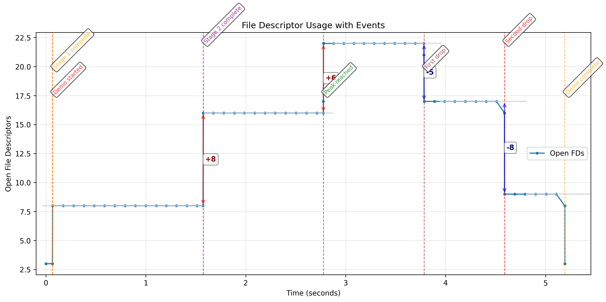
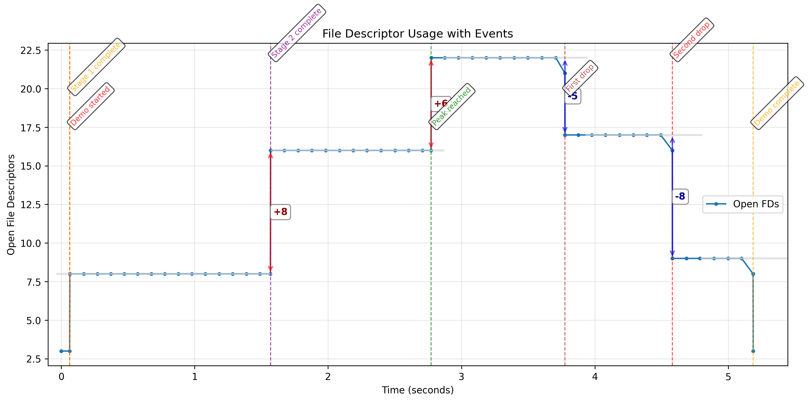
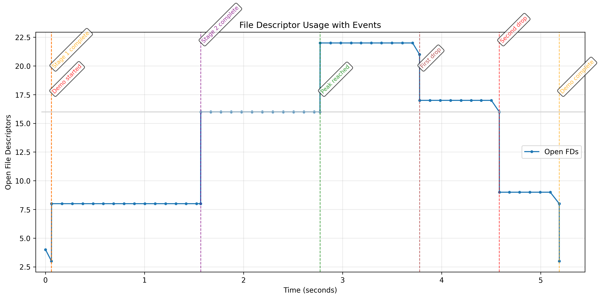

# fdprof

[](https://github.com/ianhi/fdprof/actions/workflows/ci.yml)
[](https://github.com/ianhi/fdprof/actions/workflows/pre-commit.yml)
[](https://github.com/ianhi/fdprof/actions/workflows/build.yml)
[](https://opensource.org/licenses/MIT)
[](https://www.python.org/downloads/)

A powerful file descriptor profiler that monitors FD usage and captures timestamped events in real-time. Perfect for debugging resource leaks, understanding application behavior, and performance analysis.

**🎯 Focus**: fdprof is designed for **whole-process monitoring** from the outside. It wraps any command without requiring code changes. See our [Mission Statement](MISSION.md) for design philosophy and scope.

## ✨ Features

- 📈 **Real-time FD monitoring** - Track file descriptor usage throughout command execution
- 🎯 **Event logging** - Capture timestamped events from your application output
- 📊 **Visual analysis** - Generate matplotlib plots with plateau detection and jump analysis
- 🔍 **Intelligent analysis** - Automatic detection of stable plateaus and significant jumps
- ⚙️ **Configurable** - Customizable sampling intervals and detection parameters
- 🚀 **Easy installation** - Install as a uvx tool for instant use

## 🚀 Installation

### Option 1: uv tool (Recommended)

Install as a persistent tool with uv:

```bash
# Install from PyPI (when published)
uv tool install fdprof

# Install from GitHub repository
uv tool install git+https://github.com/ianhi/fdprof

# Run without installing (temporary)
uvx fdprof <command> [args...]
```

### Option 2: pip install

```bash
pip install fdprof
```

### Option 3: Development install

```bash
git clone https://github.com/ianhi/fdprof
cd fdprof
uv sync --extra dev
```

### Verify Installation

```bash
# Check if fdprof is installed
fdprof --help

# Test with a simple command
fdprof echo "Hello World"

# Try the built-in demo
fdprof fdprof-demo

# Or with visualization
fdprof --plot fdprof-demo
```

## 📖 Usage

### Basic Command Line Interface

```bash
fdprof [OPTIONS] <command> [command_args...]
```

### Options

| Option | Description | Default |
|--------|-------------|---------|
| `--plot` | Show interactive plot after command completes | `False` |
| `--save FILENAME` | Save plot to file (PNG, PDF, SVG) instead of showing | None |
| `--interval SECONDS` | Sampling interval in seconds | `0.1` |
| `--merge-threshold FLOAT` | Merge plateaus within this FD difference | `5.0` |
| `--min-length INT` | Minimum points for plateau detection | `5` |
| `--tolerance FLOAT` | Stability tolerance for plateaus | `2.0` |
| `--jump-threshold FLOAT` | Minimum jump size to display on plot | `2.0` |

### Quick Examples

```bash
# Try the built-in demo
fdprof fdprof-demo

# Demo with visualization (recommended)
fdprof --plot fdprof-demo

# Basic monitoring
fdprof python my_script.py

# With visualization
fdprof --plot python my_script.py

# Custom sampling rate (every 0.05 seconds)
fdprof --interval 0.05 --plot python my_script.py

# Monitor a web server startup
fdprof --plot gunicorn app:app

# Profile a database migration
fdprof --plot python manage.py migrate
```

## 🧪 Built-in Demo

fdprof includes a built-in demo that creates realistic FD usage patterns perfect for testing and learning:

```bash
# Run the demo (basic monitoring)
fdprof fdprof-demo

# Run with visualization (recommended)
fdprof --plot fdprof-demo

# Run with custom sampling
fdprof --interval 0.05 --plot fdprof-demo
```

### What the Demo Does

The demo script creates a realistic FD usage pattern with:

- **6 stages** of file operations (3 opening, 3 closing)
- **Plateaus and jumps** perfect for testing fdprof's analysis
- **7 timestamped events** for visualization
- **Automatic cleanup** - no files left behind

**Expected pattern:**

1. Opens 5 files → plateau at +5 FDs
2. Opens 8 more files → jump to +13 FDs
3. Opens 6 more files → jump to +19 FDs (peak)
4. Closes first 5 files → drop to +14 FDs
5. Closes next 8 files → drop to +6 FDs
6. Closes remaining files → back to baseline

This creates clear plateaus and jumps that demonstrate fdprof's detection capabilities.

### Demo Visualization


*Default sensitivity (merge-threshold=5.0): Shows 5 distinct plateaus with clear jump annotations*

The plot shows:

- **5 distinct plateaus**: Baseline (8 FDs) → Stage 1 (16 FDs) → Stage 2 (22 FDs) → Stage 3 (17 FDs) → Final (9 FDs)
- **4 labeled jumps**: +8, +6, -5, -8 FDs with red/blue directional arrows
- **7 event markers**: Timestamped events aligned with plateau transitions
- **Automatic analysis**: Console output shows detected plateaus and jump timings

## 📸 Generating Images for Documentation

fdprof can save plots directly to files for documentation, presentations, or CI/CD:

```bash
# Basic demo plot (default sensitivity)
fdprof --save fdprof_demo.png fdprof-demo

# High sensitivity plot (more detailed plateaus)
fdprof --save fdprof_high_sensitivity.png --merge-threshold 1.0 --jump-threshold 1.0 fdprof-demo

# Low sensitivity plot (merges small changes)
fdprof --save fdprof_low_sensitivity.png --merge-threshold 50.0 --jump-threshold 10.0 fdprof-demo
```

**Supported formats**: PNG, PDF, SVG
**Features**: 300 DPI, tight bounds, headless-compatible

### Sensitivity Comparison

**High Sensitivity** (merge-threshold=1.0):

*More detailed plateau detection - ideal for microservices*

**Low Sensitivity** (merge-threshold=50.0):

*Single merged plateau - ideal for large applications with noise*

The generated images show:

- **Blue line**: FD usage over time with data points
- **Gray horizontal lines**: Detected stable plateaus
- **Red/blue arrows**: Jump annotations with size labels (+8, +6, -5, -8)
- **Colored vertical lines**: Event markers with timestamps
- **Rotated text**: Event descriptions at timing points

## 🎯 Event Logging

Add event logging to your applications to track important milestones:

### Python Example

```python
import time

def log_event(message: str):
    """Log a timestamped event that fdprof will capture"""
    print(f"EVENT: {time.time():.9f} {message}")

# Example application with events
log_event("Application startup")

# Open database connections
db_connections = []
for i in range(5):
    conn = create_db_connection()
    db_connections.append(conn)
    log_event(f"Database connection {i+1} established")

log_event("All connections ready")

# Your application logic here
process_data()

log_event("Processing complete")

# Cleanup
for conn in db_connections:
    conn.close()
log_event("All connections closed")
```

### Shell Script Example

```bash
#!/bin/bash
echo "EVENT: $(date +%s.%N) Script started"

# Open some files
for i in {1..3}; do
    exec {fd}< /etc/passwd
    echo "EVENT: $(date +%s.%N) Opened file descriptor $fd"
done

echo "EVENT: $(date +%s.%N) Processing data"
sleep 2

echo "EVENT: $(date +%s.%N) Script completed"
```

## 📊 Understanding the Output

### Console Output

```
Command: fdprof-demo
Logging to: fdprof.jsonl
Sampling interval: 0.1s
----------------------------------------
🔧 fdprof Demo Script - File Descriptor Usage Patterns
============================================================
📁 Stage 1: Opening initial batch of files...
✅ Opened 5 files in stage 1
EVENT: 1756830789.302727938 Stage 1 complete
⏳ Waiting 1.5 seconds (creating stable plateau)...
📁 Stage 2: Opening more files (creating FD jump)...
✅ Opened 8 more files in stage 2
EVENT: 1756830790.813626051 Stage 2 complete
...
🎉 Demo completed successfully!
----------------------------------------
Command completed with exit code: 0
Found 7 events

Event Timeline:
    0.09s: Demo started
    0.09s: Stage 1 complete
    1.60s: Stage 2 complete
    3.35s: Peak reached
    4.35s: First drop
    5.16s: Second drop
    5.77s: Demo complete

Detected 4 stable plateaus:
  Plateau 1: 25 FDs from 0.00s to 0.10s
  Plateau 2: 30 FDs from 0.15s to 1.58s
  Plateau 3: 38 FDs from 1.65s to 3.30s
  Plateau 4: 44 FDs from 3.38s to 4.32s

Detected 6 jumps between plateaus:
    0.12s: +5 FDs (25 → 30)
    1.62s: +8 FDs (30 → 38)
    3.35s: +6 FDs (38 → 44)
    4.35s: -5 FDs (44 → 39)
    5.16s: -8 FDs (39 → 31)
    5.77s: -6 FDs (31 → 25)
```

### Generated Files

- **`fdprof.jsonl`** - Raw timestamped FD data in JSON Lines format
- **Interactive plot** (with `--plot`) showing:
  - FD usage over time (blue line)
  - Stable plateaus (gray horizontal lines)
  - Jump annotations with size labels
  - Event markers (colored vertical lines)

## 🔧 Advanced Usage

### Sensitivity Parameter Tuning

Different applications require different sensitivity settings for optimal plateau detection:

```bash
# Demo-scale applications (5-20 FDs, small changes)
fdprof --plot --merge-threshold 5.0 --jump-threshold 2.0 fdprof-demo

# Micro-services (very sensitive, detect tiny changes)
fdprof --plot --merge-threshold 1.0 --tolerance 1.0 --jump-threshold 1.0 my-microservice

# Large web applications (100+ FDs, ignore small fluctuations)
fdprof --plot --merge-threshold 50.0 --min-length 20 --jump-threshold 10.0 gunicorn -w 8 app:app

# Database operations (moderate sensitivity)
fdprof --plot --merge-threshold 10.0 --jump-threshold 5.0 python manage.py migrate
```

**Parameter Guide:**

- `--merge-threshold`: Lower = more sensitive to level differences
- `--jump-threshold`: Lower = show smaller jumps on plot
- `--tolerance`: Lower = stricter plateau stability requirements
- `--min-length`: Higher = require longer stable periods

### Analyzing Different Application Types

#### Web Applications

```bash
# Monitor Flask development server
fdprof --plot flask run

# Monitor Django with database migrations
fdprof --plot python manage.py runserver

# Profile Gunicorn startup
fdprof --interval 0.05 --plot gunicorn -w 4 app:app
```

#### Database Operations

```bash
# Monitor PostgreSQL dump
fdprof --plot pg_dump mydb > backup.sql

# Profile database migration
fdprof --plot python manage.py migrate --verbosity=2
```

#### File Processing

```bash
# Monitor large file processing
fdprof --plot python process_large_files.py

# Profile backup operations
fdprof --plot tar -czf backup.tar.gz /important/data/
```

### Customizing Analysis Parameters

The plateau detection can be tuned by modifying the source code parameters:

- `min_length`: Minimum points for a plateau (default: 10)
- `tolerance`: Variance tolerance for stability (default: 3.0)
- `merge_threshold`: Level difference for merging plateaus (default: 50.0)

## 🐛 Troubleshooting

### Common Issues

#### "psutil not available" warning

```bash
# Install psutil if missing
pip install psutil
# or with uvx
uvx install --force fdprof
```

#### Permission denied on macOS/Linux

Some systems require elevated privileges for FD monitoring:

```bash
sudo fdprof --plot python my_script.py
```

#### No plot displayed

Ensure matplotlib backend is properly configured:

```bash
# Install GUI backend for matplotlib
pip install matplotlib[gui]
# or try different backend
export MPLBACKEND=TkAgg
```

### Platform-Specific Notes

- **Linux**: Full support for all features
- **macOS**: Full support, may need GUI backend for plotting
- **Windows**: Limited support (psutil.num_fds() not available)

## 📈 Use Cases

### Performance Analysis

- **Resource leak detection** - Monitor FD usage patterns to identify leaks
- **Application profiling** - Understand FD usage during different phases
- **Load testing** - Track FD consumption under various loads

### Development & Debugging

- **Database connection pooling** - Verify connection management
- **File handling** - Monitor file open/close patterns
- **Network programming** - Track socket lifecycle
- **Service startup** - Profile initialization sequences

### Operations & Monitoring

- **Deployment validation** - Ensure services start correctly
- **Resource monitoring** - Track FD usage in production
- **Incident analysis** - Analyze FD patterns during outages

## 🔍 Example Analysis

Here's what fdprof revealed when analyzing a web application startup:

```bash
fdprof --plot gunicorn -w 4 myapp:app
```

**Key insights:**

- **Initial spike** (0-2s): 15→45 FDs during worker process creation
- **Stable plateau** (2-10s): 45 FDs during normal operation
- **Event correlation**: Each "Worker spawned" event matched +8 FD increase
- **Resource leak detected**: Gradual increase from 45→52 FDs over time

This analysis helped identify a file descriptor leak in the logging module!

## 🤝 Contributing

```bash
# Setup development environment
git clone https://github.com/ianhi/fdprof
cd fdprof
make dev-setup

# Run tests
make test

# Run linting
make lint

# Run all checks
make check
```

## 📋 Requirements

- **Python 3.8+**
- **psutil** - Cross-platform process monitoring
- **matplotlib** - Plotting and visualization
- **numpy** - Numerical analysis
- **scipy** - Statistical functions

## 📄 License

MIT License - see [LICENSE](LICENSE) file for details.

## 🙏 Acknowledgments

I developed `fdprof` at [Earthmover](https://earthmover.io/) to profile file descriptor usage in [Icechunk](https://icechunk.io), a new transactional storage engine for scientific data.

## 🙋 Support

- 📖 **Documentation**: See examples above and `fdprof --help`
- 🐛 **Issues**: Report bugs and feature requests
- 💡 **Discussions**: Share use cases and analysis results

---

**Quick Start**: `uvx fdprof --plot fdprof-demo` 🚀
